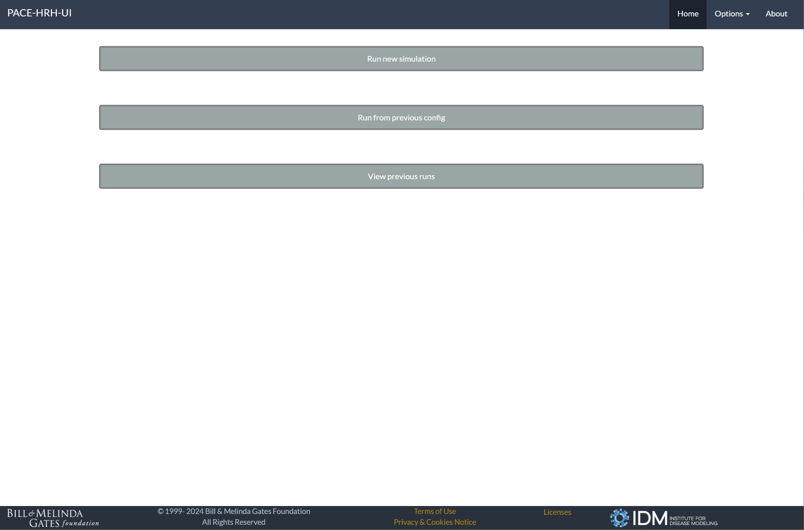
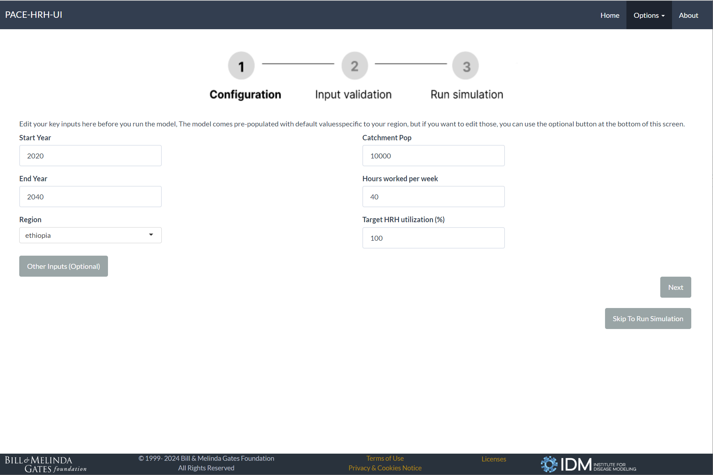
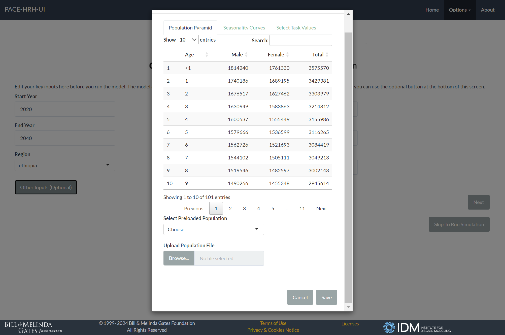
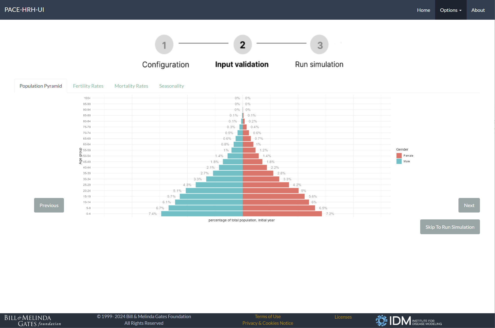
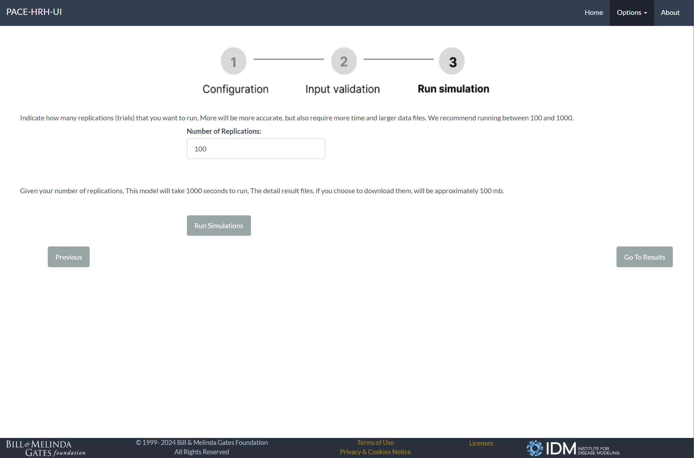
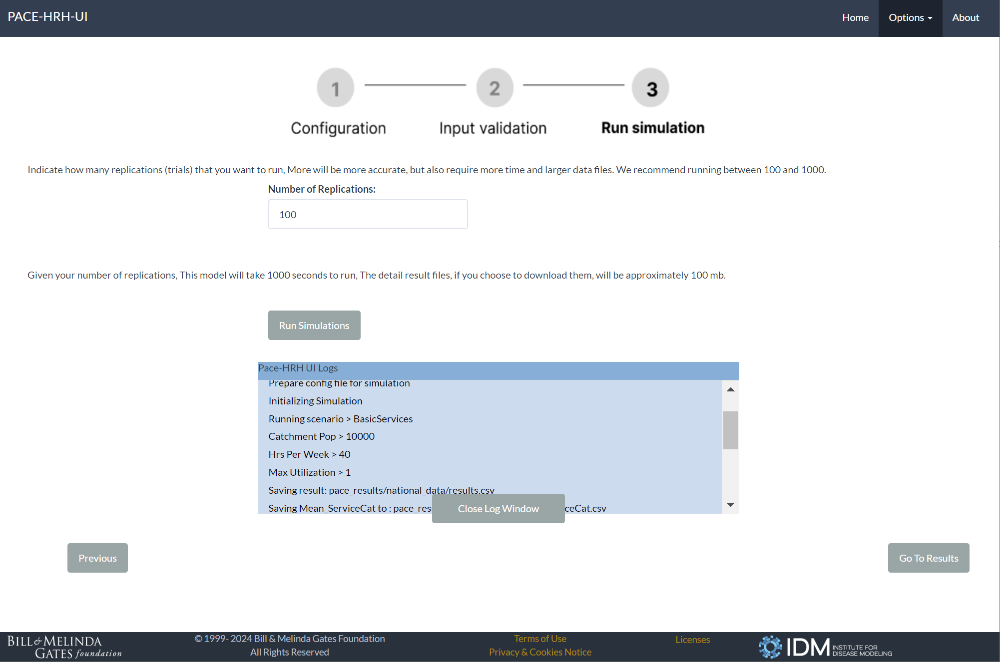
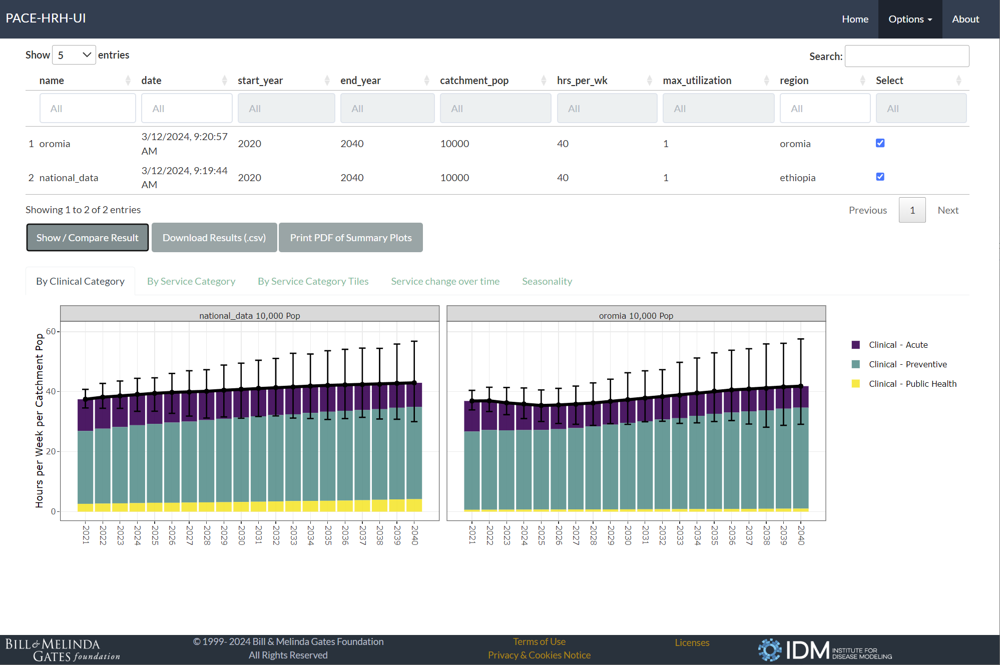
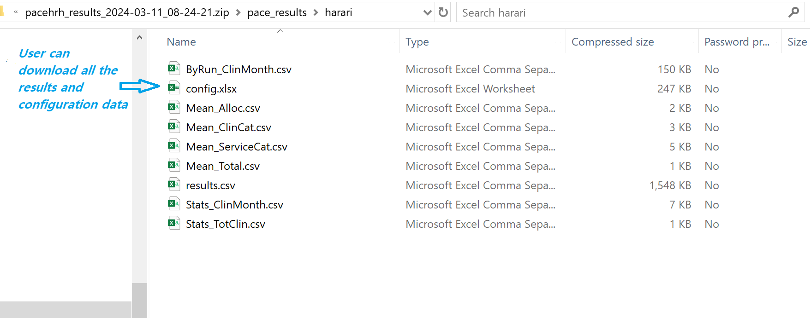

# PACE-HRH-UI

In the rapidly evolving landscape of population health management, 
there is a critical and pressing need for tools that enable efficient capacity estimation, 
taking into account various dynamic factors such as population demographics, seasonal trends, 
and health-related tasks. 
To address this challenge, we introduce an open-source software designed to serve as 
a population-aware capacity estimator. 
This application offers users the ability to configure inputs related to 
population size, seasonal variations, and specific health tasks, 
thereby providing customized capacity planning solutions tailored to different regions and diverse needs.
<br><br>
PACE-HRH-UI is a shinyapp that encapulates the [PACE-HRH](https://github.com/InstituteforDiseaseModeling/PACE-HRH/releases) package
which employs stochastic simulation for capacity projections based on excel spreadsheets configurations, 
it offers users a friendly interface to visualization the input data and simulation results. 
Users can also download and coompare results from different run for further analysis. 


### Setup
Install the most recent version of the PACE-HRH-UI binary file from our [releases](https://github.com/InstituteforDiseaseModeling/PACE-HRH-UI/releases)


### Run the app locally 
The first step is torun `install_packages.R`, once you have all the dependent packages installed, 
in RStudio open `app.R` and click on "Run App". Alternatively you can launch the app from the RStudio console with the following: 
```
library(shiny)
runApp(port=8888)
```
<br>
This will launch your default browser and open http://localhost:8888, you can use any port as you wish 
but if you switch port between two runs, your data may not be saved in the local storage.

### Installation and Run on windows without Git and Rstudio
To install the app in a separate environment: 
<br>
Download `start_pace_ui.bat` and run it by double clicking it (or open a commandline window to your downloaded folder to run it).
This will prompt you a step by step guide for installation and running the app
<br>
Once installed on your desired folder, for future use, you should go to the subfolder with name PACE-HRH-UI-{version} and run the start_pace_ui.bat from there, 
this will start the app and open your default browser so that you can interact with it. To close the app, simply press any key on the batch script window.
<br>
You can zip this pre-installed self-contained folder and send it to those who do not have internet access, they should be able to run start_pace_ui.bat without installation.
<br>

### Screenshots

- From Homepage you can start a new simulation from scrtach or use a previous run config to start.




- Configure page for simulation paramaters.


- Configure page for input data allow you to upload and preview custom data.


- Visualize your input data.


- Run simulation page allow you set simulation iterations.


- Check simulation logs for progress and potential issues.


- Visualize and download the pdf file.


- Download result files to your desktop and do your own analysis.


        
        
      
     
       
