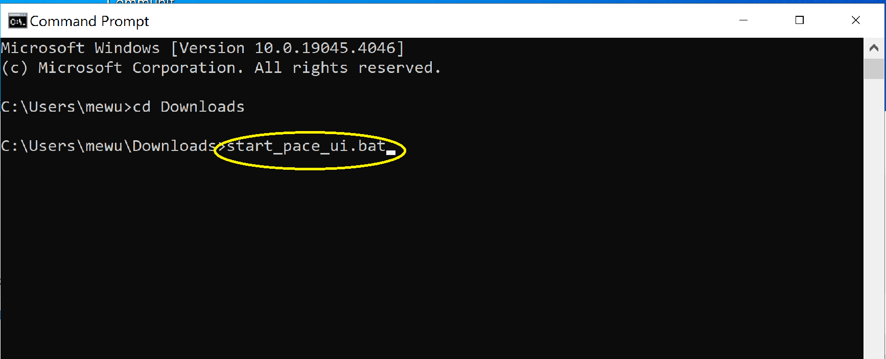

### Setup PACE-HRH-UI using batch script

1.  Download [start_pace_ui.bat](https://github.com/InstituteforDiseaseModeling/PACE-HRH-UI/blob/main/start_pace_ui.bat) to your computer. 

2.  Double-click on the downloaded file to start the PACE-HRH-UI application. Note: Your computer's antivirus scan may prevent you from running it, click on "More Info" and "Run Anyway" to proceed. 

3.  Alternatively you can use command prompt window to run it. Open a command prompt window (cmd) and navigate to the folder where you downloaded the file. Run the following command: `start_pace_ui.bat` 

4.  When you start the application, you will see a command prompt window asking for installation location. You must have internet for the first time installation. (However,You will be able to zip this "installed folder" later and send it to those who do not have internet access for offline run). You can enter either absolute or relative path. All the files needed to run will be installed into this location and you will need to launch the app from this location later. You will also need to agree on our license terms in order to proceed. 

5.  The installation may take 5-10 minutes depending on your computer's processing power and internet speed. Once the installation is completed, you will see it asking you to reopen the `start_pace_ui.bat` from your chosen directory. You can now close the command prompt window and go to this folder, from there you can restart app using the same batch script in offline mode. 

6.  After restart (double click) `start_pace_ui.bat` from your installed location, it should open the app on port 8888 using your default browser. Leave the commandline window open while interacting with the app. 
