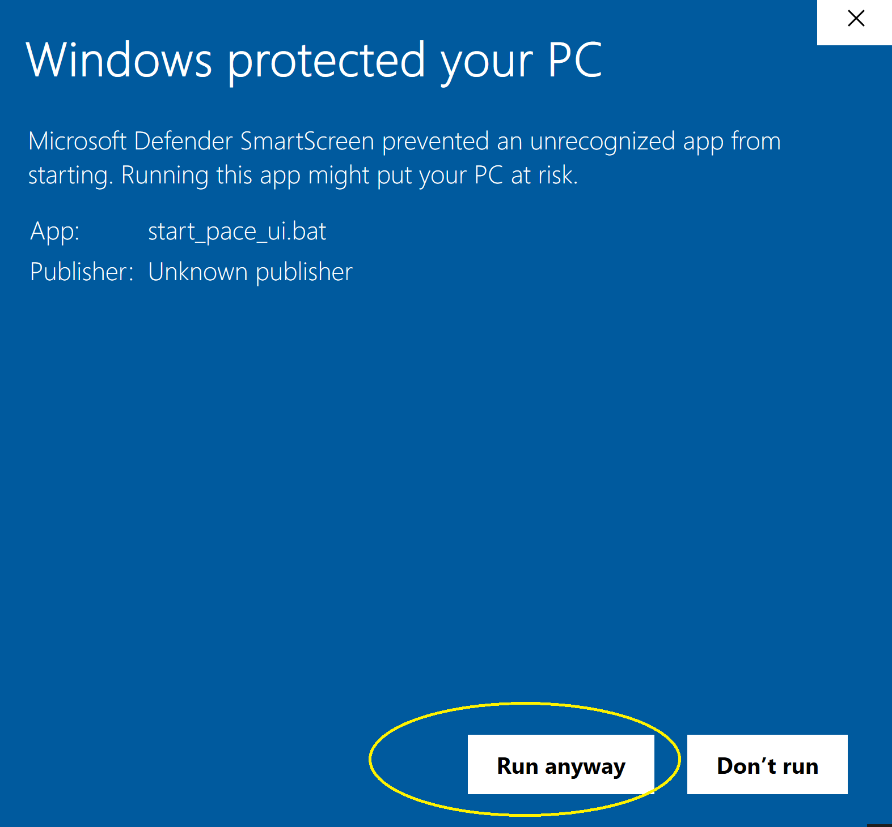

### Setup PACE-HRH-UI using batch script

1.  Download [start_pace_ui.bat](https://github.com/InstituteforDiseaseModeling/PACE-HRH-UI/blob/main/start_pace_ui.bat) to your computer. 
  

  
2.  Double-click on the downloaded file `start_pace_ui.bat` to start the PACE-HRH-UI application installation. Note: Your computer's antivirus scan may prevent you from running it, click on "More Info" and "Run Anyway" to proceed.
  

  
If this works, please ignore the following instruction about commandline and go directly to step 3.
  
If this still doesn't work you can use command prompt window to run it. In Windows search bar, type `%windir%\system32\cmd.exe` and click `Open`
  

  
This should open a command prompt window (cmd), you can navigate to the folder where you downloaded the file using `CD` command. For example `CD C:\Users\mewu\Downloads` Run the following command: `start_pace_ui.bat`. If the path has spaces, you will need to put the path in quotes. For example `CD "C:\Users\mewu\Download\My Test"` and then `start_pace_ui.bat`.
  

  

#### Installation process <!-- {#installation} -->
3.  When you start the application, you will see a command prompt window asking for installation location. **You must have internet for the first time installation.** (However,You will be able to zip this "installed folder" later and send it to those who do not have internet access for offline run). You can enter either absolute or relative path, the installation process does not accept an existing folder and will create the new folder for you. All the files needed to run will be installed into this location and you will need to launch the app from this location later. **Please write down the path so that you can remember it later.** 
**You will also need to agree on our license terms in order to proceed.**
  

  

4.  The installation may take 5-10 minutes depending on your computer's processing power and internet speed. Once the installation is completed, you will see it asking you to reopen the `start_pace_ui.bat` from your chosen directory (The one you wrote down from step 3). You can now close the command prompt window and go to this folder, from there you can launch the app using the `start_pace_ui.bat` in offline mode. 
  

  

5.  **Make sure to go to folder of your choice from step3, then double click `start_pace_ui.bat` from your installed location**, it should open the app on port 8888 using your default browser. Leave the commandline window open while interacting with the app. 
  

