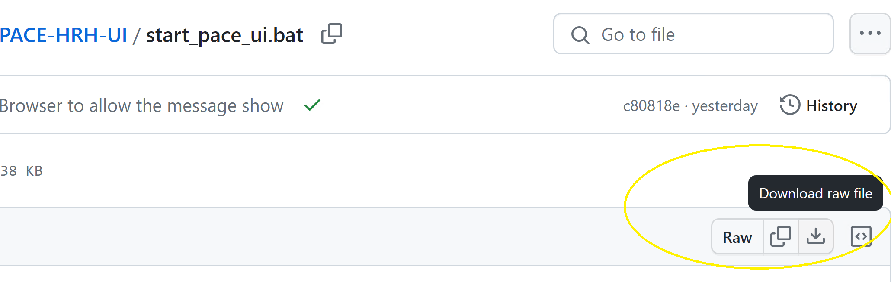
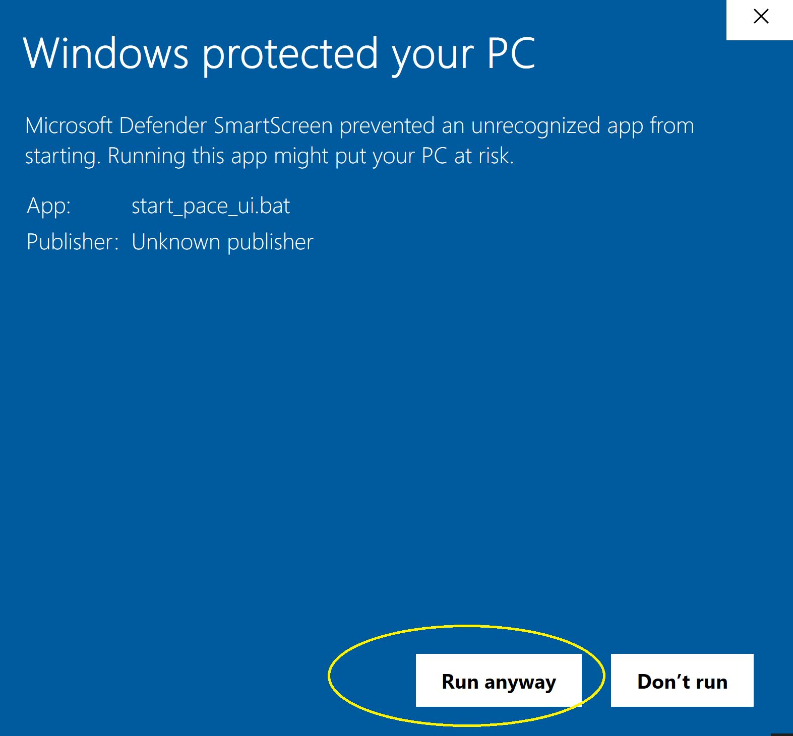
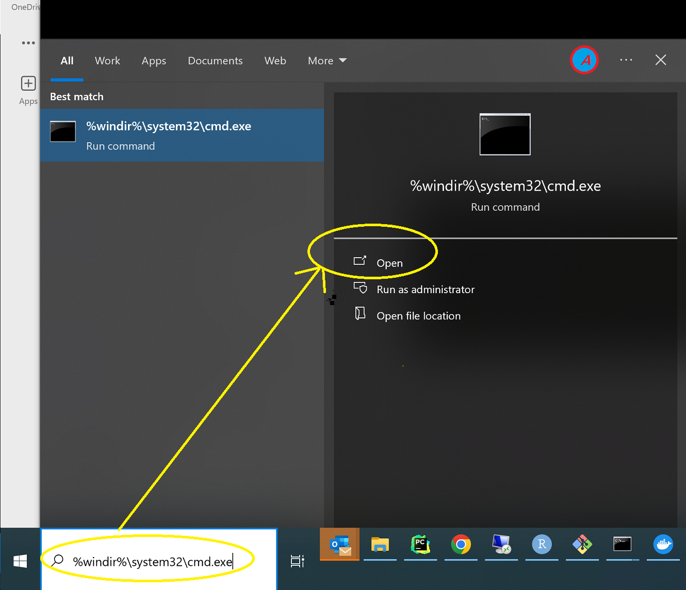
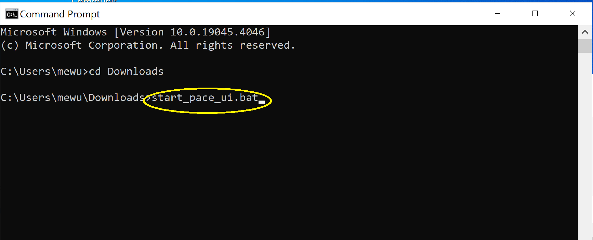
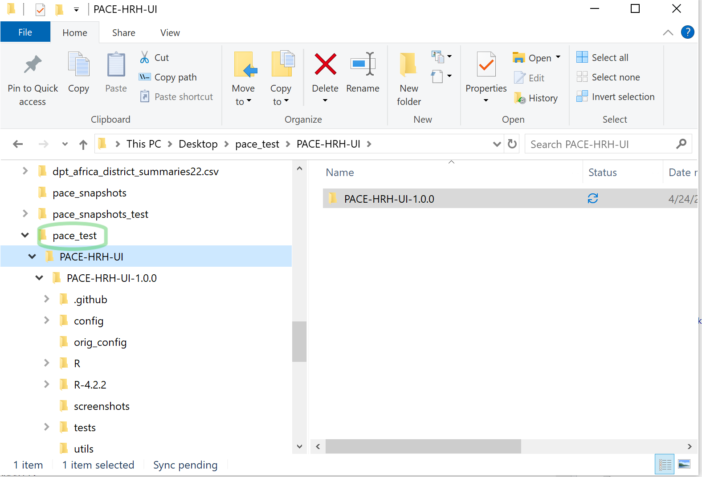
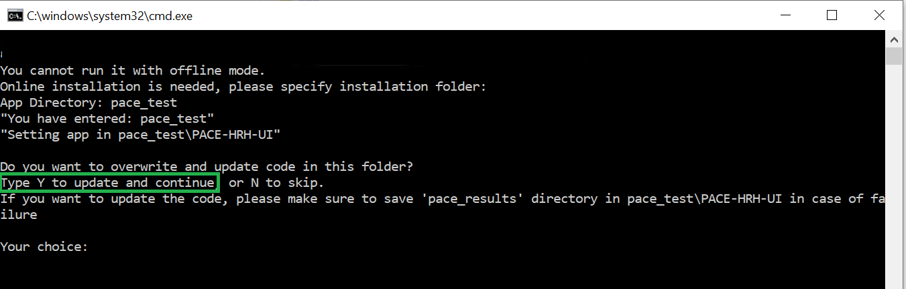
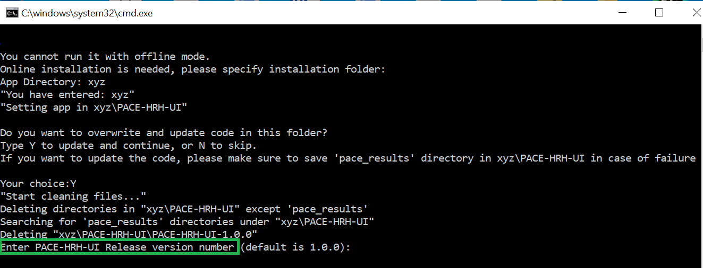

### Upgrade PACE-HRH-UI using batch script

1.  Download [start_pace_ui.bat](https://github.com/InstituteforDiseaseModeling/PACE-HRH-UI/blob/main/start_pace_ui.bat) to your computer. 
  

  
2.  Double-click on the downloaded file `start_pace_ui.bat` to start the PACE-HRH-UI application installation. Note: Your computer's antivirus scan may prevent you from running it, click on "More Info" and "Run Anyway" to proceed.
  

  
If this works, please ignore the following instruction about commandline and go directly to step 3.
  
If this still doesn't work you can use command prompt window to run it. In Windows search bar, type `%windir%\system32\cmd.exe` and click `Open`
  

  
This should open a command prompt window (cmd), you can navigate to the folder where you downloaded the file using `CD` command. For example `CD C:\Users\mewu\Downloads` Run the following command: `start_pace_ui.bat`. If the path has spaces, you will need to put the path in quotes. For example `CD "C:\Users\mewu\Download\My Test"` and then `start_pace_ui.bat`.
  

  
3.When you start the application, you will see a command prompt window asking for installation location. Since you have already installed in before, please enter the location that you used before. Using two different installation locations on the same machine will result in unexpected behavior, so always remember the path of your previous installation and update from it. The folder you enter should be the folder which contains "PACE-HRH-UI" subfolder, for example: "pace_test" in the example shown below.
  

  
4. After you enter an existing location, it will ask you to confirm the update. Type `Y` and press `Enter` to confirm the update.
  

  
5. The script will prompt you for the version of the application you want to install. You can enter the version number you want to install. For example, if you want to install version 1.0.0, you can enter `1.0.0` and press `Enter`. If you just want to use default version, please press `Enter` directly.
  

6. Follow steps as shown in <a href="Setup.md#installation-process-">installation</a> section.
